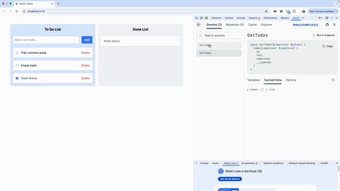

# Apollo Cache Demo

This project demonstrates how to use Apollo Client's cache management features in a React application. It includes both a frontend React application and a GraphQL server.

## Demo



## Project Structure

- `/src` - Frontend React application
- `/server` - GraphQL server implementation

## Prerequisites

- Node.js (v16 or higher)
- npm or yarn

## Setup Instructions

### 1. Install Dependencies

```bash
# Install all dependencies (both frontend and server)
npm install
```

### 2. Start the Development Server

The project uses Vite for the frontend development server. To start the development server:

```bash
npm run dev
```

This will start the frontend application at `http://localhost:5173`

### 3. Start the GraphQL Server

In a separate terminal, start the GraphQL server:

```bash
# Navigate to the server directory
cd server

# Start the server
node index.js
```

The GraphQL server will run at `http://localhost:4000`

## Features

- Apollo Client cache management
- GraphQL server with Apollo Server
- React frontend with Vite
- TailwindCSS for styling

## Cache Update Demonstrations

This project includes practical demonstrations of different methods to update the Apollo Client cache in various scenarios. Each implementation showcases different aspects of cache management:

### 1. Adding Todo Items

Commit: [`2e8f8b39f48e3a6a9cd26eb75e739e67377dc9bc`](https://github.com/AnnieChi1020/apollo-cache-demo/commit/2e8f8b39f48e3a6a9cd26eb75e739e67377dc9bc)

- Shows how to update cache after adding a todo item
- Demonstrates different approaches to update cache after creating a new todo item

### 2. Deleting Todo Items

Commit: [`add0e496a720f3dd957079fd29882bad527636f2`](https://github.com/AnnieChi1020/apollo-cache-demo/commit/add0e496a720f3dd957079fd29882bad527636f2)

- Shows how to update cache after deleting a todo item
- Demonstrates different approaches to update cache after deleting a new todo item

### 3. Updating Todo Status of Different Query

Commit: [`749325acfee04c1af1588ed73ccb9cd4cd16dc24`](https://github.com/AnnieChi1020/apollo-cache-demo/commit/749325acfee04c1af1588ed73ccb9cd4cd16dc24)

- Demonstrates updating related queries (the one used in DoneList) after changing todo completion status
- Shows how to handle cache updates across multiple queries

## Available Scripts

- `npm run dev` - Start the frontend development server
- `npm run build` - Build the frontend for production
- `npm run preview` - Preview the production build
- `npm run lint` - Run ESLint to check code quality

## Technologies Used

- React
- Apollo Client
- Apollo Server
- GraphQL
- Vite
- TailwindCSS
